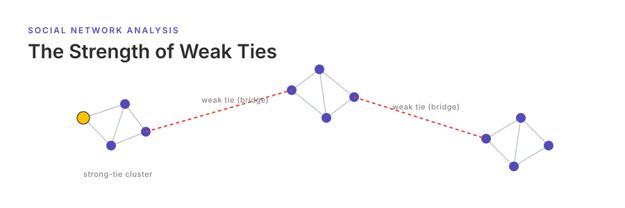

<p align="center"></p>

[English](README.md) | **日本語**

# The Strength of Weak Ties — Granovetter (1973)

Mark Granovetter の古典的論文 *The Strength of Weak Ties* (*American Journal of Sociology* 78(6), 1360–1380) の再現実装である．1973 年の原論文は概念的・プログラム的であり統制実験を持たないため，本プロジェクトはその仮説を **計測可能なエージェントベースモデルに操作化** する．すなわち，密な**強い紐帯**コミュニティ (クラスタ) を疎な**弱い紐帯ブリッジ**で接続したクラスタ網を生成し，その上で情報拡散 (SI / 閾値カスケード) を走らせる．論文の構造的命題 (「すべての (局所) ブリッジは弱い紐帯」「禁じられた三者関係の希少性」) を計測し，**弱い紐帯が到達範囲を支配する** という核心的知見を再現する．弱い紐帯を除去すると拡散はシード所属クラスタに限局し，逆に強い紐帯だけではクラスタ間を橋渡しできない．

紐帯強度は，重み付き無向 `socsim-net` ネットワーク (`WeightedNetwork<TieStrength>`) の **辺重み** として保持する (side-table ではない)．これは設計書が UNCONFIRMED として挙げていた side-table 回避策を，socsim issue #18 (重み付き辺) と #20 (局所ブリッジ・経路長の解析ヘルパ) によって解消したものである．シミュレーション本体は [socsim](https://github.com/akitenkrad/rs-social-simulation-tools) フレームワーク上の Rust，可視化ツールは Python で実装する．

> 閾値カスケードの定式化は Granovetter (1978) *Threshold Models of Collective Behavior* から借用している．1973 年論文自体は概念的である．詳細は [アーキテクチャ](docs/architecture.ja.md) を参照．

## インストールとクイックスタート

```bash
# Rust シミュレーションのビルド
cargo build --release

# 弱紐帯ブリッジ網生成 + SI 拡散 (既定に近い設定)
cargo run --release -- run --clusters 10 --cluster-size 20 \
    --p-strong 0.6 --p-bridge 0.3 --diffusion si --beta 0.5 --seed 42

# 弱紐帯除去アブレーション: 弱紐帯を除去すると到達範囲が 1 クラスタに崩壊する
cargo run --release -- ablation --remove weak \
    --clusters 10 --cluster-size 20 --p-bridge 0.5 --beta 0.9 --runs 10 --seed 42

# Python 可視化ツールのインストール (workspace ルートで)
uv sync

# 直近の実行結果を可視化する (網レイアウト + メトリクス)
uv run granovetter-tools visualize

# 論文のヘッドライン主張を 1 コマンドで再現する (PASS/off 判定 + 図)
uv run granovetter-tools reproduce
```

## ドキュメント

- [ユースケース](docs/usecases.ja.md) — 本プロジェクトでできること，他ドキュメントへの導線．
- [CLI](docs/cli.ja.md) — Rust CLI: `run` / `ablation` / `sweep` サブコマンドとフラグ．
- [可視化](docs/visualization.ja.md) — Python `granovetter-tools` と出力の読み方．
- [アーキテクチャ](docs/architecture.ja.md) — リポジトリ構成・socsim フレームワーク・網生成器・拡散メカニズム・メトリクス・参考文献．

## スコープ

本リポジトリは，クラスタ弱紐帯ブリッジ網生成器・SI / 閾値拡散メカニズム・論文の構造的命題を実装し，4 つの Rust サブコマンドとして公開する — `run` (網生成 + 拡散)，`ablation` (弱紐帯 / 強紐帯 / ランダム辺除去; 論文の主要結果)，`sweep` (パラメータスイープ)，`reproduce` (ヘッドラインとなる定量的主張を観測値 vs 期待値の PASS/off 判定付きで一括再現)．加えて Python `granovetter-tools` (`visualize` / `visualize-sweep` / `show-experiment-settings` / `reproduce`) を備える．詳細は [CLI](docs/cli.ja.md) と [可視化](docs/visualization.ja.md) を参照．

## ライセンス

MIT

---
*This file was generated by Claude Code.*
